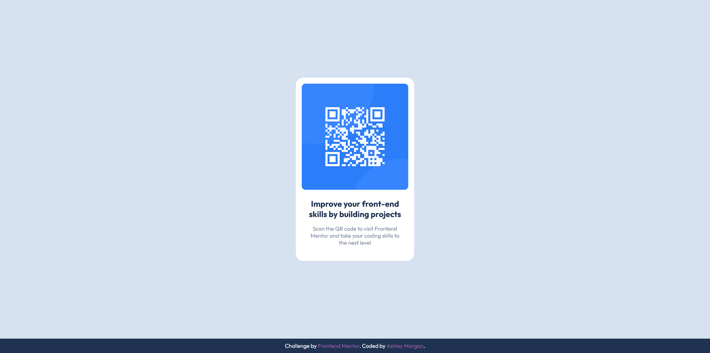

# Frontend Mentor - QR code component solution

This is a solution to the [QR code component challenge on Frontend Mentor](https://www.frontendmentor.io/challenges/qr-code-component-iux_sIO_H). Frontend Mentor challenges help you improve your coding skills by building realistic projects.

## Table of contents

- [Overview](#overview)
  - [Screenshot](#screenshot)
  - [Links](#links)
- [My process](#my-process)
  - [Built with](#built-with)
  - [Useful resources](#useful-resources)
- [Author](#author)

## Overview

### Screenshot

### Links

- Solution URL: [https://github.com/AshlavaDev/qr-code](https://github.com/AshlavaDev/qr-code)
- Live Site URL: [https://ashlavadev.github.io/qr-code/](https://ashlavadev.github.io/qr-code/)

## My process

### Built with

- Flexbox
- SASS
- CSS variable
- Prettier

### Useful resources

- [SASS](https://sass-lang.com/) - This helped me set up SASS
- [Prettier](https://prettier.io/docs/en/install) - This helped with the installation of Prettier

## Author

- Website - [Ashley Morgan](https://www.ashleymorganwbdv.com/)
- Frontend Mentor - [@AshlavaDev](https://www.frontendmentor.io/profile/AshlavaDev)
